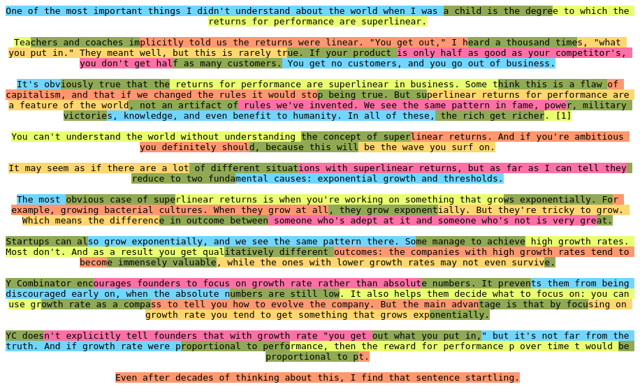
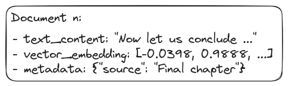
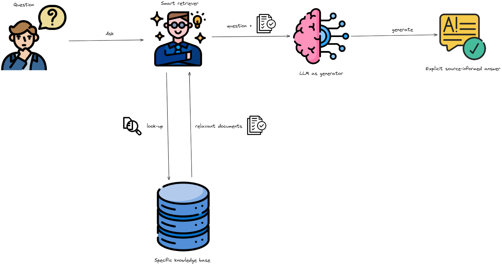

Recent years have witnessed a surge in the progress of Generative AI (GenAI), particularly Large Language Models (LLMs), which have revolutionized how humans can search for and access vital information. Conversational AI chatbots such as ChatGPT (GPT-based chatbot released by OpenAI), Meta AI (Llama-based released by Meta), Claude (Anthropic), Mistral (Cohere AI), etc., stand out as alternative methods for asking and retrieving knowledge from external resources, replacing traditional ways like Google and Wikipedia. While these applications offer numerous potential advantages, several issues need to be addressed:

* **Hallucination**: LLMs like GPT, Llama, etc., are currently pre-trained and fine-tuned on general knowledge. As a result, they perform sophisticatedly on various general tasks, such as asking for general information, conducting fundamental requests, and implementing basic code blocks. However, it is not straightforward to retrieve data precisely related to a specific topic or your area of interest, such as company policies or confidential documents.

* **Up-to-date knowledge**: Since these LLMs are trained at specific points in the past, they cannot respond to user requests with the most recent information. 

That's the primary reasons why we need RAG!

## RAG: Information retrieval + Natural language generation - Why not?
The remainder of this article will unveil the secret behind how we can achieve a final answer about the information relevant to our interested "self-plugged in" knowledge base. In other words, how we can update the knowledge of LLM models without additional efforts in fine-tuning them.

Typically, a naive RAG pipeline consists of two separate phases:  **Pre-production** and **In production**

  
   
  <em>An overview of the workflow of a basic naive RAG.</em>

**Pre-production**

* Clean, extract and transform raw data (typically documents in .pdf, .docx, .csv, etc. extension) in diverse formats into a uniform plain text format.
* Due to context limitations of LLMs, text is segmented into smaller, digestible chunks.
* Chunks are then encoded into vector representations using an embedding model and stored in vector database. This process is also called indexing phase.

**In production**

* **Retrieval**
  * Given an user's query, this module prioritizes and retrieves the top **K** chunks that demonstrate the greatest similarity to the query.
  * These chunks are subsequently used as the expanded context in prompt.

* **Generation**
  * The query and selected documents are combined into a unified prompt, which a large language model then uses to generate a response.
  * The model's method for answering can differ based on task-specific requirements, enabling it to either use its built-in parametric knowledge or limit its responses to the information in the provided documents.

## Pre-production

* Another name for this phase is called Indexing. Indexing starts with the cleaning and extraction of raw data in diverse formats like PDF, HTML, Word, and Markdown, which is then converted into a uniform plain text format.

* To accommodate the context limitations of language models, text is segmented into smaller, digestible chunks.

  
   
  <em>An example of the chunking process using a character chunking strategy with chunk size and chunk overlap of 100 and 20 characters, respectively.</em>

* Chunks are then encoded into vector representations using an embedding model and stored in vector database. 

  
   
  <em>An example of a document stored in vector database.</em>

* This step is crucial for enabling efficient similarity searches in the subsequent retrieval phase.

## In production

  
   
  <em>A basic workflow of RAG</em>

### Retriever

* When a user query is received, the RAG system uses the same encoding model that was used during indexing to convert the query into a vector representation.
* It then calculates the similarity scores between the query vector and the vectors of chunks in the indexed corpus.
* The retriever then selects top **K** chunks of documents that obtain the highest ranking scores.

### Generator

* The above retrieved chunks of text will be considered as contexts, together with the instruction and user's input query to form a complete input prompt to a LLM to generate final response.

* At this point, there are some situations that might exist:

  * You can restrict the LLM to only generate the final answer based on the given contexts. If the retrieved contexts do not resolve the user's query, simply prompt the model to generate an answer like "I'm sorry, the provided contexts are not enough to derive an appropriate answer."
  * If no restrictions have been imposed, the model may tend to synthesize the answer based on its available knowledge if the response cannot be derived from retrieved contexts.

## Wrapping Up

The emergence of Retrieval Augmented Generation (RAG) marks a breakthrough in streamlining the process of searching for relevant information from your "self-plugged in" data sources. Although it appears to be a perfect solution, some areas require significant efforts for improvement. For example, how can we ensure that the retrieved chunks are the most relevant to the user's query? How can our RAG system be adapted when the user's input query is ambiguous? There are also other aspects that need careful investigation and resolution. In this part I, we only illustrate the operation of a basic naive RAG system. Mitigating those aforementioned problems will be left for parts II and III, where we present more advanced approaches: advanced RAG and modular RAG. We hope you enjoy this and stay tuned for our next articles.

