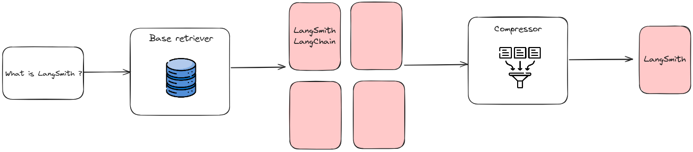

After retrieval, it is not a good practice to directly input all the retrieved information to the LLM for answering questions. Following will introduce adjustments from two perspectives: adjusting the retrieved content and adjusting the LLM.

## Context Curation

Redundant information can interfere with the final generation of LLM, and overly long contexts can also lead LLM to the “Lost in the middle” problem. Like humans, LLM tends to only focus on the beginning and end of long texts, while forgetting the middle portion. Therefore, in the RAG system, we typically need to further process the retrieved content.

### Reranking

Reranking reorganizes document chunks to prioritize the most relevant results, effectively narrowing the document pool. This serves a dual role in information retrieval: enhancing the quality of results while also acting as a filter, providing more refined inputs for accurate language model processing.

Reranking can be achieved through rule-based methods that rely on predefined metrics such as Diversity, Relevance, and MRR, or through model-based approaches. These include Encoder-Decoder models from the BERT series (e.g., SpanBERT), specialized reranking models like Cohere rerank or bge-raranker-large, and general large language models like GPT.

  
   
  <em>An example of the order of retrieved document chunks after reranking.</em>

### Context Selection/Compression

A common misconception in the RAG process is the belief that retrieving as many relevant documents as possible and concatenating them to form a lengthy retrieval prompt is beneficial. However, excessive context can introduce more noise, diminishing the LLM’s perception of key information.

- Utilize small language models (SLMs) such as GPT-2 Small or LLaMA-7B, to detect and remove unimportant tokens, transforming it into a form that is challenging for humans to comprehend but well understood by LLMs. This approach presents a direct and practical method for prompt compression, eliminating the need for additional training of LLMs while balancing language integrity and compression ratio.

- In addition to compressing the context, reducing the number of documents aslo helps improve the accuracy of the
model’s answers.

- Another straightforward and effective approach involves having the LLM evaluate the retrieved content before generating the final answer. This allows the LLM to filter out documents with poor relevance through LLM critique.

  
   
  <em>An example of compressing retrieved document chunks to reduce noise from original long contexts.</em>

### Reinprocal Rank Fusion

Reciprocal rank fusion (RRF) is a reranking algorithm that gives a reciprocal rank to documents in multiple sources, then combines those ranks and documents into one final reranked list. It has been found that RRF outperforms many other document reranking methods while being sensitive to its parameters. Utilizing RRF as a reranker in a RAG algorithm yields RAG-Fusion.

#### What's RAG-Fusion ?

Once the original query is received, the model sends the original query to the large language model to generate a number of new search queries based on the original query. For example, if the user’s original query is "Tell me about MEMs microphones," the generated queries may include:

- What are MEMs microphones and how do they work?
- What are the advantages of using MEMs microphones?
- What are some recommended MEMs microphones?

The algorithm then performs vector search to find a number of relevant documents like with RAG. But, instead of sending those documents with the queries to the large language model to generate the output, the model performs reciprocal rank fusion. Reciprocal rank fusion is an algorithm commonly used in search to assign scores to every document and rerank them according to the scores.

  
   
  <em>An example of compressing retrieved document chunks to reduce noise from original long contexts.</em>

## LLM Fine-tuning

- Targeted fine-tuning based on the scenario and data characteristics on LLMs can yield better results. This is also one of the greatest advantages of using on-premise LLMs. When LLMs lack data in a specific domain, additional knowledge can be provided to the LLM through fine-tuning. 

- Another benefit of fine-tuning is the ability to adjust the
model’s input and output. For example, it can enable LLM to
adapt to specific data formats and generate responses in a particular style as instructed.

- Aligning LLM outputs with human or retriever preferences
through reinforcement learning is a potential approach. For
instance, manually annotating the final generated answers
and then providing feedback through reinforcement learning.

## Wrapping Up
In conclusion, both pre-retrieval and post-retrieval processes play vital roles in optimizing information retrieval systems. The pre-retrieval process focuses on enhancing the indexing structure and refining the original query to improve the quality and relevance of the content being indexed. This involves various strategies, such as optimizing index structures, adding metadata, and transforming queries. On the other hand, the post-retrieval process ensures that the retrieved content is effectively integrated with the query by re-ranking information and compressing context. This prevents information overload and highlights the most relevant details. Together, these processes ensure a more precise and relevant retrieval of information, ultimately leading to better outcomes in data retrieval tasks.

In the last part of this RAG series, we will introduce Modular RAG, which offers enhanced adaptability and versatility. It incorporates diverse strategies for improving its components, such as adding a search module for similarity searches and refining the retriever through fine-tuning. Innovations like restructured RAG modules and rearranged RAG pipelines have been introduced to tackle specific challenges. The shift towards a modular RAG approach is becoming prevalent, supporting both sequential processing and integrated end-to-end training across its components.

Stay tuned and wait for the next part of this series 😃.